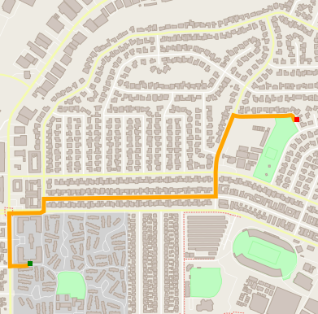

# Route Planning Project

In this project, I have implemented A* route planning algorithm in C++. Given the inital and goal position on a real-world map, the algorithm will compute an optimal path in term of distance.

The map is downloaded from [OpenStreetMap](https://www.openstreetmap.org/#map=19/34.18144/-118.19963). The data structure used in A* algorithm, i.e., RouteModel is derived from a base class Model defined in the example codes in [IO2D library](https://github.com/cpp-io2d/P0267_RefImpl). IO2D library also visualizes the result. Further the project requires [pugixml library](https://pugixml.org/) which is included in the thirdparty folder.



## Cloning

When cloning this project, be sure to use the `--recurse-submodules` flag.

```
git clone https://github.com/yangfan/Astar-Route-Planning.git --recurse-submodules
```

## Compiling and Running

### Compiling

To compile the project, first, create a `build` directory and change to that directory:

```
mkdir build && cd build
```

From within the `build` directory, then run `cmake` and `make` as follows:

```
cmake ..
make
```

### Running

The executable will be placed in the `results/bin/` directory. At root path of the project, you can run the project as follows:

```
./results/bin/OSM_A_star_search 
```

Or to specify a map file:

```
./results/bin/OSM_A_star_search -f ../<your_osm_file.osm>
```

For example:

```
$ ./results/bin/OSM_A_star_search
To specify a map file use the following format: 
Usage: [executable] [-f filename.osm]
Reading OpenStreetMap data from the following file: ./data/map.osm
Please input the start_x: 
10
Please input the start_y: 
20
Please input the end_x: 
90
Please input the end_y: 
60
Distance: 982.793 meters. 
```

The output path is shown in figure above.

## Summary of A*

A*(map, initial_position, goal_position)  

1. Initialization  
   - start_x, start_y, end_x, end_y
   - create RouteModel from given map
   - for all nodes
      - g = inf, h = euclidean distance to the end node, visited = false, explored = false
   - g(start_node) = 0
   - add the start node to the open list

2. while the open list is not empty  
   - sort the open list by f = g + h
   - current node becomes the node with the least f value, marked as visited, deleted from open list
   - if current node is the goal node
       - break
   - else for each unvisited neighbor of current node
       - compute g = g(current) + dist(current, neighbor)
       - if g < g(neighbor)
           - mark parent(neighbor) = current
           - g(neighbor) = g
       - if neighbor is not explored yet
           - add neighbor to the open list
           - mark neighbor as explored
  
3. if current node is the goal node
   - find path by sequentially travelling parent of nodes starting from the current node

- else no path is found

## Credits

This project is created based on the [course metrials](https://github.com/udacity/CppND-Route-Planning-Project) of Udacity C++ Nanodegree Program.
